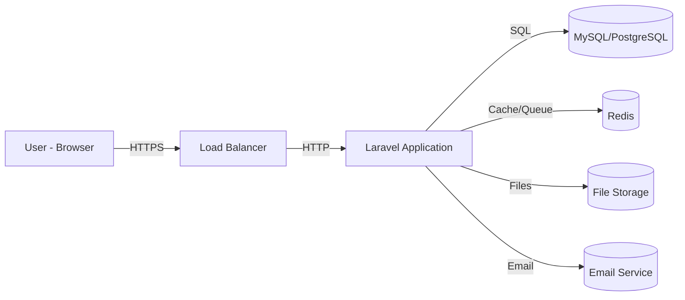

# System Design

## Konteks dan Tujuan

Sistem ERP modular berbasis Laravel 12 dan React dengan arsitektur DDD-Lite Modular Monolith. Sistem ini dirancang untuk mengelola data karyawan, workflow HR, dan dokumen perusahaan dalam satu platform terintegrasi.

## Kondisi Saat Ini Repository Bukti

- Tech stack: Laravel 12, PHP 8.2+, React 19, TypeScript 5, Inertia.js, Tailwind CSS 4
- 18 modul aktif: 16 HR modules + DocumentManagement + Console
- Module system dengan MakeModuleCommand dan ModuleRegistry
- Spatie Laravel Permission untuk RBAC
- Spatie Media Library untuk file management
- PHPUnit untuk backend testing
- Vitest untuk frontend testing
- Shared Kernel di app/Shared/ untuk ValueObjects dan base classes

## Gaya Arsitektur

**DDD-Lite Modular Monolith** dipilih karena:
- Satu repository, satu deployment unit
- Modularitas untuk separation of concerns
- DDD principles tanpa kompleksitas berlebihan
- Cocok untuk tim kecil-menengah
- Mudah evolusi ke microservices jika diperlukan

## Konteks Sistem



## Containers/Runtime Komponen

| Komponen | Tanggung Jawab | Teknologi | Data Dimiliki | Dependensi |
|---|---|---|---|---|
| Web Server | Serve static assets, reverse proxy | Nginx/Apache | - | App |
| PHP-FPM | PHP runtime | PHP 8.2 FPM | - | App, DB |
| Laravel App | Business logic, routing | Laravel 12 | Application data | DB, Redis |
| Queue Worker | Async job processing | Laravel Queue | Queue jobs | Redis, App |
| Scheduler | Cron jobs | Laravel Scheduler | Scheduled tasks | App |
| Vite | Frontend build | Vite 6 | Compiled assets | Node.js |

## Alur Utama

### Alur 1: Employee Onboarding
```
HR Staff -> Create Employee -> OnboardingAction -> Generate Checklist
-> Assign Tasks -> Notify Parties -> Track Progress -> Complete -> Activate Employee
```

### Alur 2: Document Management
```
User -> Upload Document -> Validation -> Store in Media Library
-> Set Expiry Date -> Schedule Alert -> Monitor -> Alert 30 Days Before -> Renew/Archive
```

### Alur 3: Cross-Module Communication
```
Module A -> Contract Interface -> Module B Implementation -> Return Data
Module A -> Event Dispatch -> Event Listener (Module C) -> Async Processing
```

## Module/Dependency Aturan

1. Modul dibentuk berdasarkan domain bisnis, bukan teknologi
2. Setiap data memiliki satu modul pemilik
3. Controller tidak menyimpan logika bisnis
4. Komunikasi antar-modul melalui Contract, Event, atau Query
5. Shared Kernel minimal dan stabil
6. Tidak ada circular dependency

## Data Ownership dan Consistency

| Data | Modul Pemilik | Akses Modul Lain |
|---|---|---|
| Employee data | HR/Employees | Read via Contract |
| Position data | HR/Positions | Read via Contract |
| Organization data | HR/OrganizationStructures | Read via Contract |
| Document data | DocumentManagement | Read via Contract |
| User/Role data | Shared (Spatie) | Direct access |

## Komunikasi Pola

### Sinkron (Contract)
- Digunakan ketika hasil dibutuhkan langsung
- Contoh: Get employee data for document assignment
- Implementasi: Interface + Service binding

### Asinkron (Event)
- Digunakan untuk notification dan side effects
- Contoh: Employee created -> Send welcome email
- Implementasi: Laravel Events + Listeners

### Query/Read Service
- Digunakan untuk reporting dan read-only access
- Contoh: HR report join multiple tables
- Implementasi: Direct query atau Read Model

## Keamanan Arsitektur

1. **Authentication**: Laravel Sanctum/Jetstream
2. **Authorization**: Spatie Permission (RBAC)
3. **Input Validation**: Form Requests
4. **SQL Injection Prevention**: Eloquent ORM
5. **XSS Prevention**: Blade escaping, React sanitization
6. **CSRF Protection**: Laravel CSRF tokens
7. **File Upload Security**: Media library validation
8. **Audit Logging**: All sensitive actions logged

## Keandalan dan Kegagalan Penanganan

1. **Database Transactions**: DB::transaction untuk atomic operations
2. **Queue Retry**: Failed jobs dengan retry mechanism
3. **Event Idempotency**: Listener harus idempotent
4. **Error Handling**: Laravel exception handler
5. **Logging**: Monolog dengan multiple channels
6. **Health Checks**: /up, /ready endpoints

## Deployment Topologi

```
Production:
- Load Balancer (Nginx)
- 2x App Servers (PHP-FPM)
- 1x Database Primary
- 1x Database Replica (optional)
- 1x Redis Server
- 1x File Storage (S3 or local)

Staging:
- 1x App Server
- 1x Database
- 1x Redis

Development:
- Laravel Sail (Docker)
- Single container with all services
```

## Observability

1. **Logging**: Laravel Log (daily rotation)
2. **Metrics**: Laravel Telescope (dev), custom metrics (prod)
3. **Tracing**: OpenTelemetry (optional)
4. **Alerting**: Laravel Notifications -> Slack/Email
5. **Monitoring**: Uptime monitoring, error tracking (Sentry)

## Trade-off

| Keputusan | Trade-off |
|---|---|
| Modular Monolith | Lebih kompleks dari monolith tradisional, lebih sederhana dari microservices |
| DDD-Lite | Tidak se-murni full DDD, tapi lebih praktis |
| Single Database | Simpler, tapi coupling data |
| Inertia.js | Less API complexity, tapi coupled frontend-backend |
| Spatie Packages | Faster development, tapi dependency on third-party |

## Pertanyaan Terbuka Arsitektural

1. Apakah perlu multi-tenant support di masa depan?
2. Apakah perlu API gateway untuk external consumers?
3. Apakah perlu CQRS full implementation untuk reporting?
4. Bagaimana strategi jika perlu scale ke microservices?
5. Apakah perlu event sourcing untuk audit trail?

## ADR Terkait

- ADR-0001: Restrukturisasi Struktur Modul ke DDD-Lite Layered Structure
