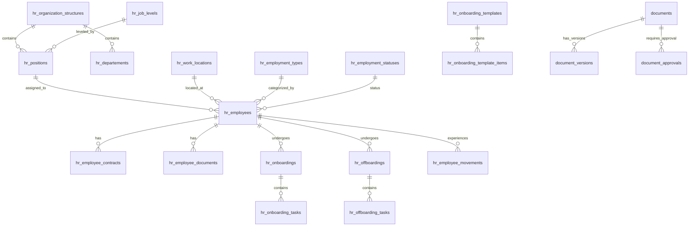

# Database Design

## Overview

Database design untuk ERP system dengan arsitektur DDD-Lite Modular Monolith. Single database dengan shared schema untuk semua modul.

## Entity Relationship Diagram



## Tabel HR/WorkLocations

| Kolom | Tipe | Constraint | Deskripsi |
|---|---|---|---|
| id | CHAR(26) | PRIMARY KEY, ULID | Primary key |
| name | VARCHAR(255) | NOT NULL | Nama lokasi |
| slug | VARCHAR(255) | UNIQUE, NOT NULL | Slug unik |
| address | TEXT | NULL | Alamat lengkap |
| city | VARCHAR(100) | NULL | Kota |
| province | VARCHAR(100) | NULL | Provinsi |
| country | VARCHAR(100) | DEFAULT 'Indonesia' | Negara |
| is_active | BOOLEAN | DEFAULT TRUE | Status aktif |
| created_at | TIMESTAMP | NULL | Created timestamp |
| updated_at | TIMESTAMP | NULL | Updated timestamp |
| deleted_at | TIMESTAMP | NULL | Soft delete timestamp |

## Tabel HR/Positions

| Kolom | Tipe | Constraint | Deskripsi |
|---|---|---|---|
| id | CHAR(26) | PRIMARY KEY, ULID | Primary key |
| title | VARCHAR(255) | NOT NULL | Jabatan |
| slug | VARCHAR(255) | UNIQUE, NOT NULL | Slug unik |
| code | VARCHAR(50) | NULL | Kode posisi |
| level_id | CHAR(26) | FOREIGN KEY -> hr_job_levels.id | Level jabatan |
| department_id | CHAR(26) | FOREIGN KEY -> hr_departements.id | Departemen |
| is_active | BOOLEAN | DEFAULT TRUE | Status aktif |
| created_at | TIMESTAMP | NULL | Created timestamp |
| updated_at | TIMESTAMP | NULL | Updated timestamp |
| deleted_at | TIMESTAMP | NULL | Soft delete timestamp |

## Tabel HR/Employees

| Kolom | Tipe | Constraint | Deskripsi |
|---|---|---|---|
| id | CHAR(26) | PRIMARY KEY, ULID | Primary key |
| user_id | CHAR(26) | FOREIGN KEY -> users.id, NULL | User关联 |
| employee_number | VARCHAR(50) | UNIQUE, NOT NULL | Nomor karyawan |
| full_name | VARCHAR(255) | NOT NULL | Nama lengkap |
| email | VARCHAR(255) | UNIQUE, NOT NULL | Email |
| phone | VARCHAR(50) | NULL | Telepon |
| birth_date | DATE | NULL | Tanggal lahir |
| gender | ENUM('male', 'female') | NULL | Jenis kelamin |
| work_location_id | CHAR(26) | FOREIGN KEY -> hr_work_locations.id | Lokasi kerja |
| position_id | CHAR(26) | FOREIGN KEY -> hr_positions.id | Posisi |
| employment_type_id | CHAR(26) | FOREIGN KEY -> hr_employment_types.id | Tipe employment |
| employment_status_id | CHAR(26) | FOREIGN KEY -> hr_employment_statuses.id | Status employment |
| hire_date | DATE | NOT NULL | Tanggal hire |
| is_active | BOOLEAN | DEFAULT TRUE | Status aktif |
| created_at | TIMESTAMP | NULL | Created timestamp |
| updated_at | TIMESTAMP | NULL | Updated timestamp |
| deleted_at | TIMESTAMP | NULL | Soft delete timestamp |

## Tabel HR/EmployeeContracts

| Kolom | Tipe | Constraint | Deskripsi |
|---|---|---|---|
| id | CHAR(26) | PRIMARY KEY, ULID | Primary key |
| employee_id | CHAR(26) | FOREIGN KEY -> hr_employees.id | Employee |
| contract_type | ENUM('permanent', 'fixed_term', 'probation', 'outsourced') | NOT NULL | Tipe kontrak |
| start_date | DATE | NOT NULL | Tanggal mulai |
| end_date | DATE | NULL | Tanggal berakhir (untuk fixed_term) |
| salary | BIGINT | NULL | Gaji (dalam sen) |
| currency | VARCHAR(3) | DEFAULT 'IDR' | Mata uang |
| benefits | JSON | NULL | Benefits |
| status | ENUM('active', 'expired', 'terminated', 'renewed') | DEFAULT 'active' | Status kontrak |
| document_id | CHAR(26) | FOREIGN KEY -> documents.id, NULL | Dokumen kontrak |
| created_at | TIMESTAMP | NULL | Created timestamp |
| updated_at | TIMESTAMP | NULL | Updated timestamp |

## Tabel HR/EmployeeDocuments

| Kolom | Tipe | Constraint | Deskripsi |
|---|---|---|---|
| id | CHAR(26) | PRIMARY KEY, ULID | Primary key |
| employee_id | CHAR(26) | FOREIGN KEY -> hr_employees.id | Employee |
| document_type_id | CHAR(26) | FOREIGN KEY -> hr_reference_data.id | Tipe dokumen |
| title | VARCHAR(255) | NOT NULL | Judul dokumen |
| document_id | CHAR(26) | FOREIGN KEY -> documents.id | Dokumen fisik |
| issue_date | DATE | NULL | Tanggal terbit |
| expiry_date | DATE | NULL | Tanggal expiry |
| is_verified | BOOLEAN | DEFAULT FALSE | Terverifikasi |
| verified_at | TIMESTAMP | NULL | Tanggal verifikasi |
| verified_by | CHAR(26) | FOREIGN KEY -> users.id, NULL | Verifier |
| created_at | TIMESTAMP | NULL | Created timestamp |
| updated_at | TIMESTAMP | NULL | Updated timestamp |

## Tabel HR/Onboardings

| Kolom | Tipe | Constraint | Deskripsi |
|---|---|---|---|
| id | CHAR(26) | PRIMARY KEY, ULID | Primary key |
| employee_id | CHAR(26) | FOREIGN KEY -> hr_employees.id, UNIQUE | Employee |
| template_id | CHAR(26) | FOREIGN KEY -> hr_onboarding_templates.id | Template |
| status | ENUM('pending', 'in_progress', 'completed', 'cancelled') | DEFAULT 'pending' | Status |
| started_at | DATE | NULL | Tanggal mulai |
| completed_at | DATE | NULL | Tanggal selesai |
| created_at | TIMESTAMP | NULL | Created timestamp |
| updated_at | TIMESTAMP | NULL | Updated timestamp |

## Tabel HR/OnboardingTasks

| Kolom | Tipe | Constraint | Deskripsi |
|---|---|---|---|
| id | CHAR(26) | PRIMARY KEY, ULID | Primary key |
| onboarding_id | CHAR(26) | FOREIGN KEY -> hr_onboardings.id | Onboarding |
| template_item_id | CHAR(26) | FOREIGN KEY -> hr_onboarding_template_items.id | Template item |
| title | VARCHAR(255) | NOT NULL | Judul task |
| assignee_id | CHAR(26) | FOREIGN KEY -> users.id, NULL | Ditugaskan ke |
| status | ENUM('pending', 'in_progress', 'completed', 'skipped') | DEFAULT 'pending' | Status |
| due_date | DATE | NULL | Tanggal jatuh tempo |
| completed_at | TIMESTAMP | NULL | Tanggal selesai |
| completed_by | CHAR(26) | FOREIGN KEY -> users.id, NULL | Yang menyelesaikan |
| created_at | TIMESTAMP | NULL | Created timestamp |
| updated_at | TIMESTAMP | NULL | Updated timestamp |

## Tabel HR/Offboardings

| Kolom | Tipe | Constraint | Deskripsi |
|---|---|---|---|
| id | CHAR(26) | PRIMARY KEY, ULID | Primary key |
| employee_id | CHAR(26) | FOREIGN KEY -> hr_employees.id, UNIQUE | Employee |
| template_id | CHAR(26) | FOREIGN KEY -> hr_offboarding_templates.id | Template |
| reason | TEXT | NOT NULL | Alasan |
| resignation_type | ENUM('voluntary', 'involuntary', 'retirement', 'end_of_contract') | NOT NULL | Tipe resignasi |
| status | ENUM('pending', 'in_progress', 'completed', 'cancelled') | DEFAULT 'pending' | Status |
| requested_date | DATE | NOT NULL | Tanggal pengajuan |
| effective_date | DATE | NOT NULL | Tanggal efektif |
| completed_at | DATE | NULL | Tanggal selesai |
| created_at | TIMESTAMP | NULL | Created timestamp |
| updated_at | TIMESTAMP | NULL | Updated timestamp |

## Tabel Documents

| Kolom | Tipe | Constraint | Deskripsi |
|---|---|---|---|
| id | CHAR(26) | PRIMARY KEY, ULID | Primary key |
| category_id | CHAR(26) | FOREIGN KEY -> hr_reference_data.id | Kategori |
| title | VARCHAR(255) | NOT NULL | Judul |
| slug | VARCHAR(255) | NOT NULL | Slug |
| owner_type | VARCHAR(255) | NOT NULL | Owner model type |
| owner_id | CHAR(26) | NOT NULL | Owner model id |
| current_version | INTEGER | DEFAULT 1 | Versi saat ini |
| status | ENUM('draft', 'pending_approval', 'approved', 'rejected', 'archived') | DEFAULT 'draft' | Status |
| is_confidential | BOOLEAN | DEFAULT FALSE | Rahasia |
| created_at | TIMESTAMP | NULL | Created timestamp |
| updated_at | TIMESTAMP | NULL | Updated timestamp |

## Tabel DocumentVersions

| Kolom | Tipe | Constraint | Deskripsi |
|---|---|---|---|
| id | CHAR(26) | PRIMARY KEY, ULID | Primary key |
| document_id | CHAR(26) | FOREIGN KEY -> documents.id | Document |
| version | INTEGER | NOT NULL | Nomor versi |
| file_path | VARCHAR(255) | NOT NULL | Path file |
| mime_type | VARCHAR(100) | NOT NULL | Tipe MIME |
| file_size | BIGINT | NOT NULL | Ukuran file (bytes) |
| uploaded_by | CHAR(26) | FOREIGN KEY -> users.id | Uploader |
| change_summary | TEXT | NULL | Ringkasan perubahan |
| created_at | TIMESTAMP | NULL | Created timestamp |

## Tabel DocumentApprovals

| Kolom | Tipe | Constraint | Deskripsi |
|---|---|---|---|
| id | CHAR(26) | PRIMARY KEY, ULID | Primary key |
| document_id | CHAR(26) | FOREIGN KEY -> documents.id | Document |
| approver_id | CHAR(26) | FOREIGN KEY -> users.id | Approver |
| status | ENUM('pending', 'approved', 'rejected') | DEFAULT 'pending' | Status |
| comment | TEXT | NULL | Komentar |
| approved_at | TIMESTAMP | NULL | Tanggal approval |
| created_at | TIMESTAMP | NULL | Created timestamp |
| updated_at | TIMESTAMP | NULL | Updated timestamp |

## Indexes

```sql
-- HR/Employees
CREATE INDEX idx_employees_number ON hr_employees(employee_number);
CREATE INDEX idx_employees_email ON hr_employees(email);
CREATE INDEX idx_employees_status ON hr_employees(employment_status_id);
CREATE INDEX idx_employees_location ON hr_employees(work_location_id);

-- HR/EmployeeDocuments
CREATE INDEX idx_employee_docs_expiry ON hr_employee_documents(expiry_date);
CREATE INDEX idx_employee_docs_employee ON hr_employee_documents(employee_id);

-- HR/EmployeeContracts
CREATE INDEX idx_employee_contracts_end ON hr_employee_contracts(end_date);
CREATE INDEX idx_employee_contracts_employee ON hr_employee_contracts(employee_id);

-- Documents
CREATE INDEX idx_documents_owner ON documents(owner_type, owner_id);
CREATE INDEX idx_documents_status ON documents(status);

-- Audit Log
CREATE INDEX idx_audit_log_user ON audit_log(user_id);
CREATE INDEX idx_audit_log_created ON audit_log(created_at);
```

## Migration Strategy

1. Shared tables (users, roles, permissions) dibuat pertama
2. HR reference data tables
3. HR master data tables (work_locations, positions, departments, job_levels, employment_types, employment_statuses)
4. HR transaction tables (employees, contracts, documents, onboardings, offboardings)
5. Document management tables
6. Audit log table

## Seed Data

1. Roles: super_admin, admin, hr_admin, hr_staff, manager, employee
2. Permissions: CRUD untuk setiap modul
3. Employment types: permanent, contract, probation, outsourced
4. Employment statuses: active, on_leave, suspended, terminated
5. Document categories: identity, education, contract, certificate, other
