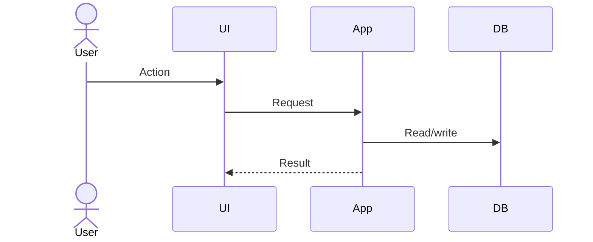

# fitur teknis Design

## fitur ID

## eksisting perilaku dan repository bukti

## diusulkan perilaku

## Components/file terdampak

| Component/path | perubahan | alasan |
|---|---|---|

## Design dan flow

## Domain/module boundary dampak

## data model dan migrasi

## API/kontrak/events

## validasi dan error penanganan

## Authorization dan keamanan

## Concurrency/idempotency

## performa

## pengujian pendekatan

## kompatibilitas

## deployment dan rollback

## Alternatif yang Dipertimbangkan

## wajib ADRs
